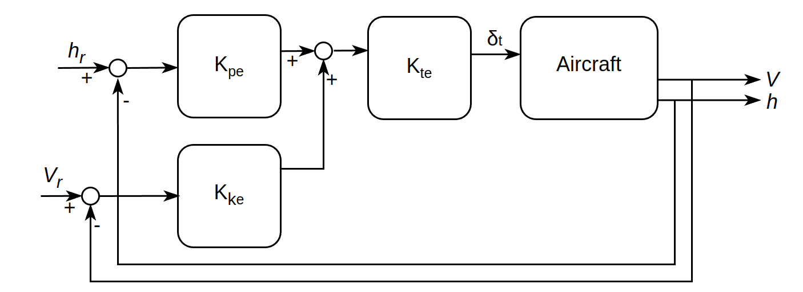

# Autopilot Design and Waypoint Navigation for Fixed-Wing Aircraft

<p align="center">
  
</p>

This repository contains a complete flight control system (autopilot) for waypoint navigation with line segment tracking for a Cessna 172. The implementation features cascaded controllers for pitch and roll control, a simplified Total Energy Control System (TECS) for throttle control, and integration with FlightGear for testing and visualization. The system enables the aircraft to autonomously navigate between waypoints while maintaining desired altitude and speed. The main components of this project include:

1. Cascaded controllers for symmetric (pitch control) and asymmetric motion (aileron and rudder control) to achieve altitude and heading hold.
2. Simplified Total Energy Control System (TECS) for speed management through thrust control
3. UDP-based integration for testing controllers in Flightgear
4. Initial gain calculations derived from a flight dynamics model using root locus analysis
5. Stability analysis with gain and phase margins for the cascaded controllers
6. Waypoint Navigation system with line segment tracking provided desired longitude, latitude, altitude & speed

# Installation

Before beginning the installation, please ensure you have the following:
   - Git: `sudo apt-get install git`
   - Flightgear (installation instructions: [Flightgear Downloads](https://www.flightgear.org/download/)) or `sudo apt-get install flightgear`

## Standard Installation

```bash
mkdir -p ~/fg_control
cd ~/fg_control
git clone https://github.com/mayank176/fg_control

#Move xml files to Protocol (this is required to process states and controls from Flightgear)
sudo cp ~/fg_control/aircraft-state.xml /usr/share/games/flightgear/Protocol/
sudo cp ~/fg_control/flight-controls.xml /usr/share/games/flightgear/Protocol/

#Installing Boost Asio
sudo apt-get update
sudo apt-get install libboost-all-dev

#Build Project
cd ~fg_control/build
cmake ..
make 

#Test 
./fg_control
```

# Usage
``` bash
# Setting up waypoints: `src/main.cpp` contains a vector of waypoints which can be modified to follow a desired set of waypoints

# Run the controller
cd ~fg_control/build
make
./fg_control

# Run Flightgear:
# add the follwing in Settings->Additional Settings in Flightgear GUI:
# --generic=socket,out,10,127.0.0.1,5505,udp,aircraft-state
# --generic=socket,in,10,127.0.0.1,5506,udp,flight-controls
# --telnet=5432
# OR run from terminal:
fgfs --generic=socket,out,10,127.0.0.1,5505,udp,aircraft-state \
     --generic=socket,in,10,127.0.0.1,5506,udp,flight-controls \
     --telnet=5432 \
     --airport=BIKF \
     --runway=19 \
     --heading=190 \
     --altitude=3000 \
     --vc=120 \
     --offset-distance=1.0 \
     --offset-azimuth=0 \
     --glideslope=3 \
     --season=summer \
     --timeofday=morning \
     --prop:/controls/flight/flaps=0.0
```
In Flightgear: press `h` for heads up display, `v` to change view

# Overview of Flight Control System

### Altitude Hold Mode: Elevator Control using Cascaded Controllers

The altitude hold system employs a three-loop cascaded control architecture that manipulates the elevator:

1. Inner Loop, Kr = 0.005 (Damping): Uses pitch rate feedback with gain Kr to improve the aircraft's natural damping characteristics
2. Middle Loop, Kθ = -0.03 (Attitude): Controls pitch angle (θ) by comparing reference and actual pitch attitudes with gain Ktheta (note: negative as negative elevator deflection (δe < 0) pitches the nose up)

3. Outer Loop, Kh = 0.05 (Altitude): Generates pitch angle commands from altitude error with gain Kh

<p align="center">
  
</p>

### Heading Hold Mode: Aileron and Rudder Control using Cascaded Controllers

The heading hold system similarly uses a three-loop structure for lateral-directional control:

1. Inner Loop, Kp = 0.004 (Damping): Provides roll damping through roll rate feedback with gain Kp
2. Middle Loop, Kφ = 0.065 (Bank Angle): Maintains desired bank (roll) angle for turns by comparing reference and actual role angles with gain Kφ
3. Outer Loop, Kψ = 0.4 (Heading): Generates bank angle commands from heading error with gain Kψ

And lastly, a yaw damper to improve turn coordination and Dutch roll damping with gain Kr,yaw = 0.02.
<p align="center">
  
</p>

<p align="center">
  
</p>

### Speed Hold Mode: Thrust Control using TECS (Total Energy Control System)

The speed hold mode maintains desired airspeed and altitude by adjusting throttle, using a simplified energy-based control approach. It balances total energy—combining altitude (potential energy) and airspeed (kinetic energy)—to determine throttle commands. Throttle increases when altitude or speed is below target, and decreases when above, with a baseline adjusted for current airspeed. Additionally, it calculates a target pitch to manage energy distribution between altitude and speed, though pitch is not currently applied. Gains shape the control response as follows:

1. Potential Energy Gain (Kpe = 0.03): Scales altitude errors (reference and actual altitude) into energy terms, emphasizing height deviations in the total energy calculation.

2. Kinetic Energy Gain (Kke = 0.006): Scales airspeed squared errors into energy terms, with a smaller value to balance the larger magnitude of squared speed differences.

3. Throttle Gain (Kte = 0.15): Converts total energy error into throttle adjustments, to command the current altitude and speed deviations. (note: negative sign is added to throttle command to match Flightgear control conventions)


<p align="center">
  
</p>

Extension:
A full TECS implementation could coordinate thrust and elevator control to completely decouple altitude and airspeed control by managing both total energy and energy distribution. This controller is implemented in `flight_controller.cpp` and follows the TECS from [NASA TECS](https://ntrs.nasa.gov/api/citations/19870017485/downloads/19870017485.pdf), and requires further tuning. 

# Waypoint Navigation and Line Segment Tracking

The flight controller provides waypoint navigation and line segment tracking to guide an aircraft along a predefined flight path. This feature calculates the desired heading, corrects for deviations, and smoothly transitions between waypoints based on the aircraft’s current position (latitude and longitude) and a sequence of waypoints.

1. Waypoint Set-up: 
in `src/main.cpp` a vector of waypoints are stored that each consist of: (latitude [°], longitude [°], altitude [ft], speed [knots]). The controller will track the line-segment between waypoints, and advances to the next waypoint when the aircraft is within 500 ft of the current one. 

2. Line-Segment Following:
A proportional controller is run at a low frequency (2 Hz) to monitor cross-track error defined as the perpendicular distance from the aircraft to the current line segment. The desired heading is updated every 2 Hz with the controller by a correction proportional to this cross-track error.

3. Look-Ahead for Smooth Following from one line segment to another (implemented for turns, to be extended for changes in altitude): 
As the aircraft approaches the next waypoint (within 350 ft) we interpolate the heading to start the turn to the headin of the next line segment. This helps reduce overshoot and anticipate turns when the orientation of the line segments may change abruptly, and in scenarios where the simulation is initialized at different positions and headings with respect to the waypoints.

Another approach for the above 'look-ahead' step would be to implement steering functions that calculate a curvature-based path to the next waypoint, ensuring the aircraft’s dynamic constraints (e.g., turn radius, speed) are satisfied. This can also be applied to scenarios where the simulation is initialized at different positions and heading with respect to waypoints.


# Package Structure
```
fg_control/                      
       ├── include/
       |   ├── flight_controller.h
       |   └── udp_io.h
       ├── src/
       |   ├── main.cpp          # Main, edit waypoints here
       |   ├── flight_controller.cpp # Controller and waypoint navigation 
       |   └── udp_io.cpp        # To send/receive states and controls from Flightgear
       └── CMakeLists.txt        # Build configuration
```
# Troubleshooting

Common issues and solutions:

1. `Error initializing UDP interface: bind: Address already in use:`

 Ensure a previous instance of controller is not running. Check: `sudo lsof -i :5505`, if there is `fg_control` then `kill -9 pid` with the processes PID number.

 # License
[MIT](https://choosealicense.com/licenses/mit/)